# Część samodzielna

## Zadanie a)
- kod
```csharp
public class ExerciseA
{
    public void run(MyDbContext context)
    {
        // Utworzenie i dodanie produktu
        Product product = new Product { ProductName = "Ball" };
        context.Products.Add(product);
        context.SaveChanges();
        // Utworzenie i dodanie dostawcy
        Supplier supplier = new Supplier { CompanyName = "Supplier1", City = "Warsaw", Street = "Marszalkowska 1" };
        context.Companies.Add(supplier);
        context.SaveChanges();

        // Znalezienie poprzedniego produktu i ustawienie dostawcy na wlasnie dodanego
        var lastProduct = context.Products.FirstOrDefault(p => p.ProductName == "Ball");
        if (lastProduct != null)
        {
            lastProduct.Supplier = supplier;
            context.SaveChanges();
        }
    }
}
```
- schemat
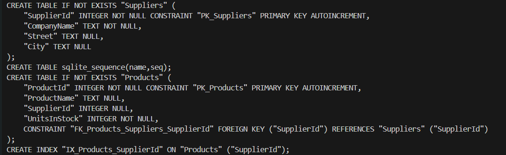
- zawartość tabeli (nazwa tabeli to companies ponieważ w późniejszych podpunktach wprowadziliśmy dziedziczenie)

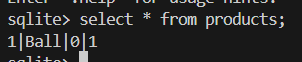
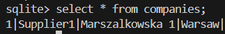

## Zadanie b)
- kod 
```csharp
public class ExerciseB
{
    public void run(MyDbContext context)
    {
        // Utworzenie i dodanie dostawcy
        Supplier supplier = new Supplier { CompanyName = "SupplierB", City = "Warsaw", Street = "Marszalkowska 2" };
        Product product1 = new Product { ProductName = "BallB1" };
        Product product2 = new Product { ProductName = "BallB2" };
        Product product3 = new Product { ProductName = "BallB3" };
        supplier.Products = new List<Product> { product1, product2, product3 };
        context.Companies.Add(supplier);
        context.SaveChanges();
    }
}
```
- tabele
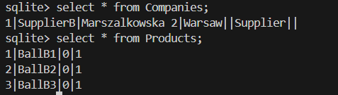

## Zadanie c)
- kod
```csharp
public class ExerciseC
{
    public void run(MyDbContext context)
    {
        Supplier supplier = new Supplier { CompanyName = "SupplierC", City = "Warsaw", Street = "Marszalkowska 3" };
        Product product1 = new Product { ProductName = "BallC1" };
        Product product2 = new Product { ProductName = "BallC2" };
        product1.Supplier = supplier;
        product2.Supplier = supplier;
        supplier.Products = new List<Product> { product1, product2 };

        context.Companies.Add(supplier);
        context.SaveChanges();
    }
}
```
- tabele
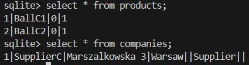

## Zadanie d)
- kod
```csharp
public class ExerciseD
{
    public void run(MyDbContext context)
    {
        //zad d
        //Dodanie produktów i faktur
        Product product1 = new Product { ProductName = "BallD1" };
        Product product2 = new Product { ProductName = "BallD2" };
        Product product3 = new Product { ProductName = "Balld3" };
        context.Products.AddRange(product1, product2, product3);
        context.SaveChanges();

        Invoice invoice1 = new Invoice { Products = new List<Product> { product1, product2 } };
        Invoice invoice2 = new Invoice { Products = new List<Product> { product2, product3 } };
        context.Invoices.Add(invoice1);
        context.Invoices.Add(invoice2);
        context.SaveChanges();

        // Produkty w danej fakturze
        int invoiceNumber = 1;

        var query = from inv in context.Invoices
                    where inv.InvoiceNumber == invoiceNumber
                    select inv.Products;
        Console.WriteLine("Produkty w fakturze o numerze: " + invoiceNumber);
        foreach (var product_list in query)
        {
            foreach (Product product in product_list)
            {
                Console.WriteLine(product.ProductName);
            }
        }

        //Faktury w ramach których został sprzedany dany produkt
        int productId = 2;

        var invoices = context.Invoices
                .Where(invoice => invoice.Products.Any(product => product.ProductId == productId))
                .ToList();

        Console.WriteLine("Faktury w ramach których został sprzedany produkt o id: "+productId);
        foreach (var invoice in invoices)
        {
            Console.WriteLine(invoice.InvoiceNumber);
        }
    }
}
```
- schemat
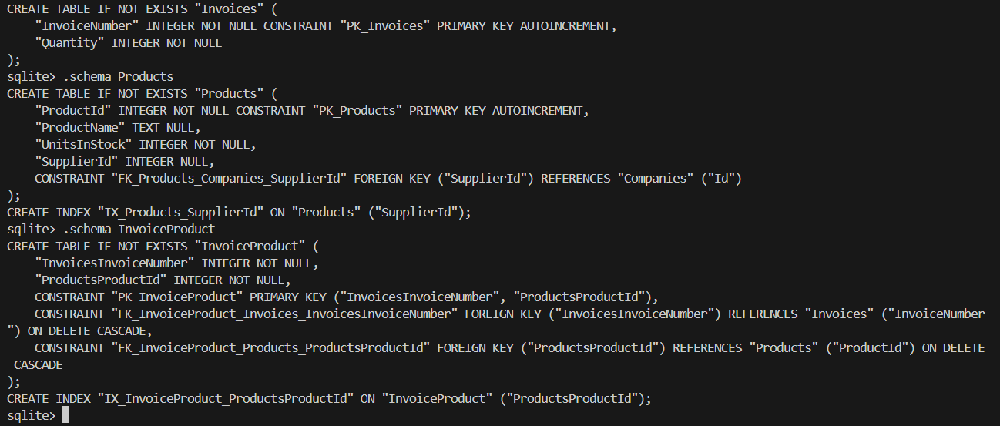
- tabele

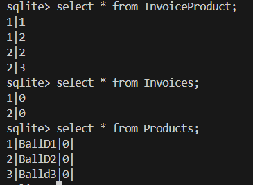
- podpunkty 2 oraz 3

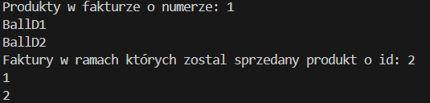

## Zadanie e)
- kod 
```csharp
public class ExerciseE
{
    public void run(MyDbContext context)
    {
        var supplier1 = new Supplier { CompanyName = "Supplier1", Street = "Street1", City = "City1", ZipCode = "Zip1", BankAccountNumber = "1234567890" };
        var supplier2 = new Supplier { CompanyName = "Supplier2", Street = "Street2", City = "City2", ZipCode = "Zip2", BankAccountNumber = "0987654321" };
        var product1 = new Product { ProductName = "Product1", Supplier = supplier1 };
        supplier1.Products = new List<Product> { product1 };

        var customer1 = new Customer { CompanyName = "Customer1", Street = "Street3", City = "City3", ZipCode = "Zip3", Discount = 0.1m };
        var customer2 = new Customer { CompanyName = "Customer2", Street = "Street4", City = "City4", ZipCode = "Zip4", Discount = 0.2m };
        context.Companies.AddRange(supplier1, supplier2, customer1, customer2);
        context.SaveChanges();

        var suppliers = context.Companies.OfType<Supplier>().ToList();
        var customers = context.Companies.OfType<Customer>().ToList();

    
        foreach (var supplier in suppliers)
        {
            Console.WriteLine($"Supplier: {supplier.CompanyName}, Bank Account: {supplier.BankAccountNumber}");
        }

        foreach (var customer in customers)
        {
            Console.WriteLine($"Customer: {customer.CompanyName}, Discount: {customer.Discount}");
        }

    }
}
```
Do klasy `MyDbContext` została dodana następująca metoda:
```csharp
     protected override void OnModelCreating(ModelBuilder modelBuilder) {
        base.OnModelCreating(modelBuilder);
        modelBuilder.Entity<Company>()
            .HasDiscriminator<string>("CompanyType")
            .HasValue<Supplier>("Supplier")
            .HasValue<Customer>("Customer");
    }
```
W tej metodzie konfigurujemy, że kolumna CompanyType jest dyskryminatorem, który określa typ każdej firmy. Za pomocą metod HasValue określamy, że wartości "Supplier" oraz "Customer" w dyskryminatorze reprezentują odpowiednio `Supplier` i `Customer`.

- tabele, schematy
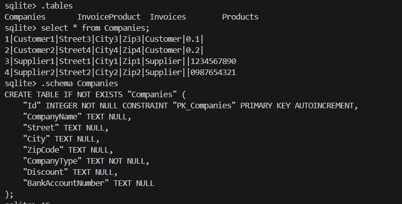

- pobrane firmy obu rodzajów

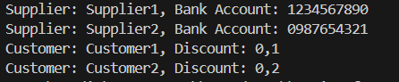

## Zadanie f)

- kod
```csharp
public class ExerciseF
{
    public void run(MyDbContext context)
    {
        var supplier1 = new Supplier { CompanyName = "SupplierF1", Street = "Street1", City = "City1", ZipCode = "Zip1", BankAccountNumber = "1234567890" };
        var supplier2 = new Supplier { CompanyName = "SupplierF2", Street = "Street2", City = "City2", ZipCode = "Zip2", BankAccountNumber = "0987654321" };
        var customer1 = new Customer { CompanyName = "CustomerF1", Street = "Street3", City = "City3", ZipCode = "Zip3", Discount = 0.1m };
        var customer2 = new Customer { CompanyName = "CustomerF2", Street = "Street4", City = "City4", ZipCode = "Zip4", Discount = 0.2m };

        context.Companies.AddRange(supplier1, supplier2, customer1, customer2);
    context.SaveChanges();

        var suppliers = context.Companies.OfType<Supplier>().ToList();
        var customers = context.Companies.OfType<Customer>().ToList();

        foreach (var supplier in suppliers)
        {
            Console.WriteLine($"Supplier: {supplier.CompanyName}, Bank Account: {supplier.BankAccountNumber}");
        }

        foreach (var customer in customers)
        {
            Console.WriteLine($"Customer: {customer.CompanyName}, Discount: {customer.Discount}");
        }
    }
}
```
Do klasy `MyDbContext` została dodana następująca metoda:
```csharp
    protected override void OnModelCreating(ModelBuilder modelBuilder) {
        base.OnModelCreating(modelBuilder);
        modelBuilder.Entity<Supplier>().ToTable("Suppliers");
        modelBuilder.Entity<Customer>().ToTable("Customers");
    }
```
Za jej pomocą konfigurujemy mapowanie TPT (Table-Per-Type). Ustawiamy, że klasy Supplier i Customer powinny być przechowywane odpowiednio w tabelach Suppliers i Customers.

- tabele oraz schematy

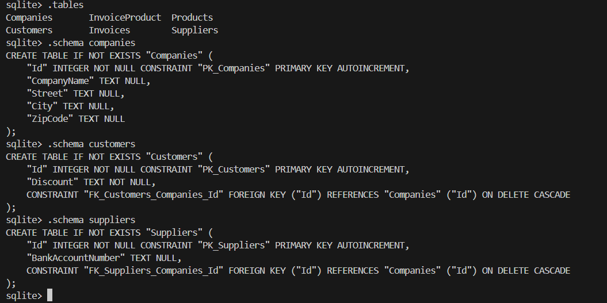

- zawartości tabel

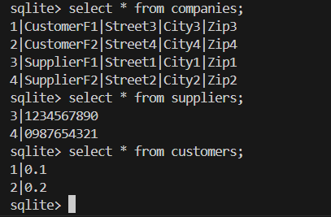

- pobrane kilka firm obu rodzajów

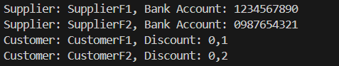

## Zadanie f)
Jak mogliśmy zauważyć w przypadku strategii dziedziczenia TPH (Table-Per-Hierarchy) wszystkie dane przechowywane są w jednej tabeli. Nie potrzebujemy robic relacji i z tego powodu niektóre zapytania mogą być znacznie szybsze. Potrzebujemy jednak do tego kolumny będącej dyskryminatorem, aby Enity Framework mógł określić, do której klasy należy dany wiersz w tabeli. Z drugiej strony możemy jednak otrzymać znaczną ilość pustych pól, jeżeli klasy mają różne pola. Wtedy te z nich, których nie posiada dana klasa są nullami.

W przypadku strategii dziedziczenia TPT (Table-Per-Type) dla każej klasy tworzona jest własna tabela, w której przechowywane są dane specyficzne dla danej klasy. Jednak wtedy aby uzyskać niektóre informacje, musimy połączyć tabelę bazową z dziedziczącą za pomocą relacji, co może być wolniejsze niż w przypadku jednej tabeli.

W obu przypadkach możemy wyszukać określone klasy w bazie np. w ten sposób:
```csharp
var suppliers = context.Companies.OfType<Supplier>().ToList();
var customers = context.Companies.OfType<Customer>().ToList();
```