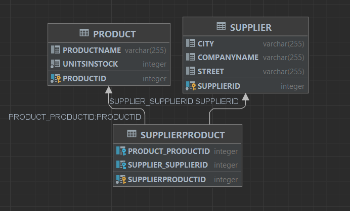

## Część I przewodnikowa

1. Pobrany został, a następnie uruchomiony serwer bazodanowy Apache Derby


2. Stworzony został nowy projekt Mavenowy w IntelliJ IDEA i dodane zostały zależności do pliku `pom.xml`

```xml
<?xml version="1.0" encoding="UTF-8"?>
<project xmlns="http://maven.apache.org/POM/4.0.0"
         xmlns:xsi="http://www.w3.org/2001/XMLSchema-instance"
         xsi:schemaLocation="http://maven.apache.org/POM/4.0.0 http://maven.apache.org/xsd/maven-4.0.0.xsd">
    <modelVersion>4.0.0</modelVersion>

    <groupId>org.example</groupId>
    <artifactId>hibernate_labs</artifactId>
    <version>1.0-SNAPSHOT</version>

    <properties>
        <maven.compiler.source>21</maven.compiler.source>
        <maven.compiler.target>21</maven.compiler.target>
        <project.build.sourceEncoding>UTF-8</project.build.sourceEncoding>
    </properties>
    <dependencies>
        <dependency>
            <groupId>org.hibernate</groupId>
            <artifactId>hibernate-core</artifactId>
            <version>6.4.4.Final</version>
        </dependency>
        <dependency>
            <groupId>org.apache.derby</groupId>
            <artifactId>derbyclient</artifactId>
            <version>10.17.1.0</version>
        </dependency>
        <dependency>
            <groupId>org.apache.derby</groupId>
            <artifactId>derbynet</artifactId>
            <version>10.17.1.0</version>
        </dependency>
    </dependencies>
</project>
```

Pojawiły nam się odpowiednie zależności w projekcie


3. Stworzony został plik `hibernate.cfg.xml` w katalogu `resources` z konfiguracją połączenia z bazą danych

```xml
<?xml version='1.0' encoding='utf-8'?>
<!DOCTYPE hibernate-configuration PUBLIC
        "-//Hibernate/Hibernate Configuration DTD 3.0//EN"
        "http://www.hibernate.org/dtd/hibernate-configuration-3.0.dtd">
<hibernate-configuration>
    <session-factory>
        <property
                name="connection.driver_class">org.apache.derby.jdbc.ClientDriver</property>
        <property
                name="connection.url">jdbc:derby://127.0.0.1/TomaszKurconDatabase</property>
        <property name="show_sql">true</property>
        <property name="format_sql">true</property>
        <property name="use_sql_comments">true</property>
        <property name="hbm2ddl.auto">create-drop</property>
    </session-factory>
</hibernate-configuration>
```

Po stworzeniu bazy zmieniliśmy:
```xml
<property name="hbm2ddl.auto">create-drop</property>
```
na
```xml
<property name="hbm2ddl.auto">update</property>
```

4. Połączyliśmy się z bazą danych

5. Dodaliśmy klasę `Product`
```java
package org.example;

import jakarta.persistence.Entity;
import jakarta.persistence.GeneratedValue;
import jakarta.persistence.GenerationType;
import jakarta.persistence.Id;

@Entity
public class Product {
    @Id
    @GeneratedValue(strategy = GenerationType.AUTO)
    private int productID;
    private String productName;
    private int unitsInStock;
    public Product(){

    }
    public Product(String productName, int unitsInStock) {
        this.productName = productName;
        this.unitsInStock = unitsInStock;
    }
}
```
Klasę tą trzeba również zmapować w pliku `hibernate.cfg.xml`

```xml
<mapping class="org.example.Product"></mapping>
```

Następnie w `main` dodaliśmy kod, który dodaje nowy produkt do bazy danych
```java
package org.example;

import org.hibernate.Session;
import org.hibernate.SessionFactory;
import org.hibernate.Transaction;
import org.hibernate.cfg.Configuration;

public class Main {
    private static SessionFactory sessionFactory = null;

    public static void main(String[] args) {
        sessionFactory = getSessionFactory();
        Session session = sessionFactory.openSession();
        Product product = new Product("Laptop", 3);
        Transaction transaction = session.beginTransaction();
        session.save(product);
        transaction.commit();
        session.close();
    }

    private static SessionFactory getSessionFactory() {
        if (sessionFactory == null) {
            Configuration configuration = new Configuration();
            sessionFactory =

                    configuration.configure().buildSessionFactory();
        }
        return sessionFactory;
    }
}
```
Po uruchomieniu programu w bazie danych pojawił się nowy produkt, a w konsoli pojawił się odpowiedni log zapytania SQL wygenerowanego przez Hibernate


## Część II samodzielna
### Zadanie 1
1. Stworzyliśmy klasę `Supplier`
```java
package org.example;

import jakarta.persistence.Entity;
import jakarta.persistence.GeneratedValue;
import jakarta.persistence.GenerationType;
import jakarta.persistence.Id;

@Entity
public class Supplier {
    @Id
    @GeneratedValue(strategy = GenerationType.AUTO)
    private int supplierID;
    private String companyName;
    private String street;
    private String city;
    
    public Supplier() {
    }
    public Supplier(String companyName, String street, String city) {
        this.companyName = companyName;
        this.street = street;
        this.city = city;
    }
}
```
i zmapowaliśmy ją w pliku `hibernate.cfg.xml`
```xml
<mapping class="org.example.Supplier"></mapping>
```

Do `Product` dodaliśmy pole `supplier` z odpowiednimi adnotacjami
```java
@ManyToOne
@JoinColumn(name = "supplierID")
private Supplier supplier;
```
a także settera i nowy konstruktor
```java
public Product(String productName, int unitsInStock, Supplier supplier) {
    this.productName = productName;
    this.unitsInStock = unitsInStock;
    this.supplier = supplier;
}
public void setSupplier(Supplier supplier) {
    this.supplier = supplier;
}
```
Następnie dodaliśmy nowego dostawcę, znaleźliśmy poprzednio wprowadzony produkt i ustawliśmy jego dostawcę na właśnie dodanego.
```java
Supplier newSupplier = new Supplier("Dell", "1234 Dell Street", "Dell City");
Transaction transaction = session.beginTransaction();
session.save(newSupplier);
Product product = session.get(Product.class, 1);
product.setSupplier(newSupplier);
session.save(product);
transaction.commit();
```
Wyniki:


Schemat:


### Zadanie 2
W celu zamodelowania zadania z tabelą łącznikową stworzyliśmy klasę `SupplierProduct`
```java
package org.example;

import jakarta.persistence.*;

@Entity
public class SupplierProduct {
    @Id
    @GeneratedValue(strategy = GenerationType.AUTO)
    private int supplierProductID;

    @ManyToOne
    private Supplier supplier;
    @ManyToOne
    private Product product;
    public SupplierProduct(){

    }
    public SupplierProduct(Supplier supplier, Product product) {
        this.supplier = supplier;
        this.product = product;
    }
}
```
Zmapowaliśmy ją w pliku `hibernate.cfg.xml`
```xml
<mapping class="org.example.SupplierProduct"></mapping>
```
Następnie dodaliśmy 3 nowe produkty i 1 dostawcę, a następnie dodaliśmy relacje między nimi
```java
Product product1 = new Product("Kredki2_1", 3);
Product product2 = new Product("Kredki2_2", 5);
Product product3 = new Product("Kredki2_3", 4);

Supplier supplier = new Supplier("Dell2", "1234 Dell Street", "Dell City");
SupplierProduct supplierProduct1 = new SupplierProduct(supplier, product1);
SupplierProduct supplierProduct2 = new SupplierProduct(supplier, product2);
SupplierProduct supplierProduct3 = new SupplierProduct(supplier, product3);
Transaction transaction = session.beginTransaction();
session.save(product1);
session.save(product2);
session.save(product3);

session.save(supplier);

session.save(supplierProduct1);
session.save(supplierProduct2);
session.save(supplierProduct3);
transaction.commit();
```

Wyniki:




W celu wykonania zadania bez użycia tabeli łącznikowej do klasy `Supplier` został dodany atrybut:
```java
@OneToMany
@JoinColumn(name = "supplierID")
private List<Product> products;
```
oraz `setter`
```java
    public void setProducts(List<Product> products) {
        this.products = products;
    }
```

Dodaliśmy 3 nowe produkty i dostawcę, a następnie ustawiliśmy dostawcy produkty, które dostarcza
```java
        Product product1 = new Product("Kredki2_1", 3);
        Product product2 = new Product("Kredki2_2", 5);
        Product product3 = new Product("Kredki2_3", 4);
        List<Product> products = List.of(product1, product2, product3);
        Supplier supplier = new Supplier("Dell2", "1234 Dell Street", "Dell City");
        supplier.setProducts(products);
        Transaction transaction = session.beginTransaction();
        session.save(product1);
        session.save(product2);
        session.save(product3);
        session.save(supplier);
        transaction.commit();
```
Wyniki:


### Zadanie 3
W klasie `Product` dodajemy nowy atrybut z odpowiednimi adnotacjami
```java
@ManyToOne
@JoinColumn(name = "supplierID")
private Supplier supplier;
```
Natomiast w klasie `Supplier`:
```java
@OneToMany(mappedBy = "supplier")
private List<Product> products;
```

Dodaliśmy 3 nowe produkty i 1 dostawcę, a następnie dodaliśmy relacje między nimi: Supplier supplies Products and Products are supplied by Supplier
```java
        Product product1 = new Product("Kredki3_1", 3);
        Product product2 = new Product("Kredki3_2", 5);
        Product product3 = new Product("Kredki3_3", 4);

        Supplier supplier = new Supplier("Dell3", "1234 Dell Street", "Dell City");
        List<Product> products = List.of(product1, product2, product3);

        product1.setSupplier(supplier);
        product2.setSupplier(supplier);
        product3.setSupplier(supplier);

        supplier.setProducts(products);

        Transaction transaction = session.beginTransaction();
        session.save(product1);
        session.save(product2);
        session.save(product3);
        session.save(supplier);
        transaction.commit();
```
Wyniki


## Zadanie 4
Na początku dodana została odpowiednia klasa `Category`

```java
package org.example;

import jakarta.persistence.*;

import java.util.ArrayList;
import java.util.List;

@Entity
public class Category {
    @Id
    @GeneratedValue(strategy = GenerationType.AUTO)
    private int categoryID;
    private String name;
    @OneToMany
    @JoinColumn(name = "categoryID")
    private List<Product> products;

    public Category() {
    }
    
    public Category(String name) {
        this.name = name;
        this.products = new ArrayList<>();
    }

    public List<Product> getProducts() {
        return products;
    }
    public void setProducts(List<Product> products) {
        this.products = products;
    }

    public String getName() {
        return name;
    }

    public int getCategoryID() {
        return categoryID;
    }
}
```
gdzie za stworzenie relacji odpowiedzialne jest pole:
```java
@OneToMany
@JoinColumn(name = "categoryID")
private List<Product> products;
```
W klasie `Product` dodane zostało pole:
```java
@ManyToOne
@JoinColumn(name = "categoryID")
private Category category;
```
oraz `getter` i `setter`
```java
  public void setCategory(Category category) {
        this.category = category;
    }
    public Category getCategory() {
        return category;
    }
```
Stworzyliśmy 2 kategorie oraz 3 produkty i dodaliśmy je do nowych kategorii. Następnie wydobyliśmy produkty należące do pierwszej z stworzonych kategorii oraz kategorię do której należy trzeci stworzony produkt
```java
Category category1 = new Category("Kategoria4_1");
        Category category2 = new Category("Kategoria4_2");

        Product product1 = new Product("Kredki4_1", 3);
        Product product2 = new Product("Kredki4_2", 5);
        Product product3 = new Product("Kredki4_3", 4);

        category1.setProducts(List.of(product1, product2));

        product3.setCategory(category2);

        Transaction transaction = session.beginTransaction();
        session.save(category1);
        session.save(category2);

        session.save(product1);
        session.save(product2);
        session.save(product3);

        transaction.commit();

        session.refresh(category1);
        Category category = session.get(Category.class, category1.getCategoryID());
        System.out.println("Wydobycie produktów z kategorii: Kategoria4_1");
        category.getProducts().forEach(product -> System.out.println("Product name: " + product.getProductName() + "\nProduct Category: " + category1.getName()));
        System.out.println("Wydobycie kategorii do której należy produkt " + product3.getProductName());
        System.out.println(product3.getCategory().getName());
```

Wyniki:


