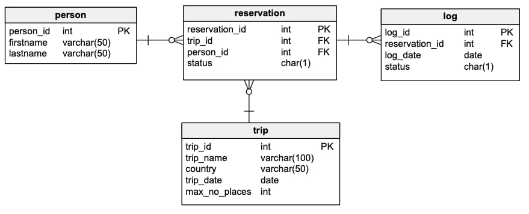
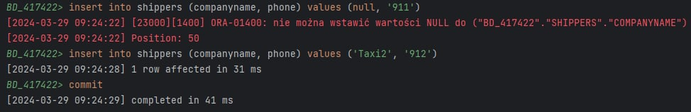
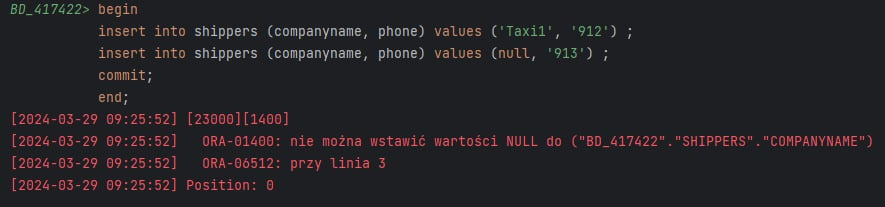
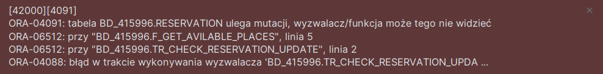

# Oracle PL/Sql

widoki, funkcje, procedury, triggery
ćwiczenie

---


Imiona i nazwiska autorów :
- Helena Szczepanowska
- Tomasz Kurcoń

---
<style>
  {
    font-size: 16pt;
  }
</style> 

<style scoped>
 li, p {
    font-size: 14pt;
  }
</style> 

<style scoped>
 pre {
    font-size: 10pt;
  }
</style> 

# Tabele




- `Trip`  - wycieczki
	- `trip_id` - identyfikator, klucz główny
	- `trip_name` - nazwa wycieczki
	- `country` - nazwa kraju
	- `trip_date` - data
	- `max_no_places` -  maksymalna liczba miejsc na wycieczkę
- `Person` - osoby
	- `person_id` - identyfikator, klucz główny
	- `firstname` - imię
	- `lastname` - nazwisko


- `Reservation`  - rezerwacje
	- `reservation_id` - identyfikator, klucz główny
	- `trip_id` - identyfikator wycieczki
	- `person_id` - identyfikator osoby
	- `status` - status rezerwacji
		- `N` – New - Nowa
		- `P` – Confirmed and Paid – Potwierdzona  i zapłacona
		- `C` – Canceled - Anulowana
- `Log` - dziennik zmian statusów rezerwacji 
	- `log_id` - identyfikator, klucz główny
	- `reservation_id` - identyfikator rezerwacji
	- `log_date` - data zmiany
	- `status` - status


```sql
create sequence s_person_seq  
   start with 1  
   increment by 1;

create table person  
(  
  person_id int not null
      constraint pk_person  
         primary key,
  firstname varchar(50),  
  lastname varchar(50)
)  

alter table person  
    modify person_id int default s_person_seq.nextval;
   
```


```sql
create sequence s_trip_seq  
   start with 1  
   increment by 1;

create table trip  
(  
  trip_id int  not null
     constraint pk_trip  
         primary key, 
  trip_name varchar(100),  
  country varchar(50),  
  trip_date date,  
  max_no_places int
);  

alter table trip 
    modify trip_id int default s_trip_seq.nextval;
```


```sql
create sequence s_reservation_seq  
   start with 1  
   increment by 1;

create table reservation  
(  
  reservation_id int not null
      constraint pk_reservation  
         primary key, 
  trip_id int,  
  person_id int,  
  status char(1)
);  

alter table reservation 
    modify reservation_id int default s_reservation_seq.nextval;


alter table reservation  
add constraint reservation_fk1 foreign key  
( person_id ) references person ( person_id ); 
  
alter table reservation  
add constraint reservation_fk2 foreign key  
( trip_id ) references trip ( trip_id );  
  
alter table reservation  
add constraint reservation_chk1 check  
(status in ('N','P','C'));

```


```sql
create sequence s_log_seq  
   start with 1  
   increment by 1;


create table log  
(  
    log_id int not null
         constraint pk_log  
         primary key,
    reservation_id int not null,  
    log_date date not null,  
    status char(1)
);  

alter table log 
    modify log_id int default s_log_seq.nextval;
  
alter table log  
add constraint log_chk1 check  
(status in ('N','P','C')) enable;
  
alter table log  
add constraint log_fk1 foreign key  
( reservation_id ) references reservation ( reservation_id );
```


---
# Dane


Należy wypełnić  tabele przykładowymi danymi 
- 4 wycieczki
- 10 osób
- 10  rezerwacji

Dane testowe powinny być różnorodne (wycieczki w przyszłości, wycieczki w przeszłości, rezerwacje o różnym statusie itp.) tak, żeby umożliwić testowanie napisanych procedur.

W razie potrzeby należy zmodyfikować dane tak żeby przetestować różne przypadki.


```sql
-- trip
insert into trip(trip_name, country, trip_date, max_no_places)  
values ('Wycieczka do Paryza', 'Francja', to_date('2023-09-12', 'YYYY-MM-DD'), 3);  
  
insert into trip(trip_name, country, trip_date,  max_no_places)  
values ('Piekny Krakow', 'Polska', to_date('2025-05-03','YYYY-MM-DD'), 2);  
  
insert into trip(trip_name, country, trip_date,  max_no_places)  
values ('Znow do Francji', 'Francja', to_date('2025-05-01','YYYY-MM-DD'), 2);  
  
insert into trip(trip_name, country, trip_date,  max_no_places)  
values ('Hel', 'Polska', to_date('2025-05-01','YYYY-MM-DD'),  2);

-- person
insert into person(firstname, lastname)  
values ('Jan', 'Nowak');  
  
insert into person(firstname, lastname)  
values ('Jan', 'Kowalski');  
  
insert into person(firstname, lastname)  
values ('Jan', 'Nowakowski');  
  
insert into person(firstname, lastname)  
values  ('Novak', 'Nowak');

-- reservation
-- trip1
insert  into reservation(trip_id, person_id, status)  
values (1, 1, 'P');  
  
insert into reservation(trip_id, person_id, status)  
values (1, 2, 'N');  
  
-- trip 2  
insert into reservation(trip_id, person_id, status)  
values (2, 1, 'P');  
  
insert into reservation(trip_id, person_id, status)  
values (2, 4, 'C');  
  
-- trip 3  
insert into reservation(trip_id, person_id, status)  
values (2, 4, 'P');
```

proszę pamiętać o zatwierdzeniu transakcji

---
# Zadanie 0 - modyfikacja danych, transakcje

Należy przeprowadzić kilka eksperymentów związanych ze wstawianiem, modyfikacją i usuwaniem danych
oraz wykorzystaniem transakcji

Skomentuj dzialanie transakcji. Jak działa polecenie `commit`, `rollback`?.
Co się dzieje w przypadku wystąpienia błędów podczas wykonywania transakcji? Porównaj sposób programowania operacji wykorzystujących transakcje w Oracle PL/SQL ze znanym ci systemem/językiem MS Sqlserver T-SQL

pomocne mogą być materiały dostępne tu:
https://upel.agh.edu.pl/mod/folder/view.php?id=214774
w szczególności dokument: `1_modyf.pdf`

---
# Zadanie 0  - rozwiązanie

Polecenie `commit` służy do zatwierdzania dokonanych transakcji tak, aby zmiany były stale widoczne. Dopóki transakcja nie zostanie zatwierdzona, wszystkie operacje traktowane jako tymczasowe i widoczne tylko dla sesji, która wykonała te operacje.

Polecenie `rollback` pozwala na cofnięcie niezatwierdzonych jeszcze za pomocą polecenia `commit` zmian. Zmiany wprowadzone przez transakcję są anulowane, a dane przywracane do stanu, w jakim znajdowały się przed rozpoczęciem transakcji. 

W przypadku wystąpienia błędów podczas wykonywania transakcji zostaje ona przerwana, jednak Oracle PL/SQL oferuje możliwość obsługi błędów przy pomocy bloków, w których można zadeklarować jak postępować z danymi błędami i wyjątkami.

Dodatkowo przy wystąpieniu wyjątku przy użyciu poleceń zapisanych indywidulanie każde z nich traktowane jest osobno i nie wykona się tylko ten, w którym wystąpił wyjątek, jednak gdy polecenia są zapisane przy pomocy bloku to w przypadku wystąpienia wyjątku cała transakcja zostaje przerwana, chyba że zadeklarowano inaczej w instrukcji obsługi wyjątków w danym bloku.

W podanym poniżej przykładzie przy założeniu, że `companyname` nie może być nullem, możemy zauważyć tę różnicę.

I sposób 
```sql
insert into shippers (companyname, phone) values (null, '911');
insert into shippers (companyname, phone) values ('Taxi2', '912');
commit;
```




II sposób
```sql
begin
insert into shippers (companyname, phone) values ('Taxi1', '912') ;
insert into shippers (companyname, phone) values (null, '913') ;
commit;
end;
```



Transkacje w Oracle PL/SQL nieco różnią się od znanych z języka MS Sqlserver T-SQL. Zauważalną różnicą jest potrzeba używania polecenia `commit` oraz `rollback', gdzie w MS Sqlserver T-SQL wszelkie transakcje zatwierdzane są automatycznie, dopóki nie występują błędy, a w Oracle PL/SQL to użytkownik ma nad tym pełną kontrolę. Dodatkowo różni się sposób obsługi błedów. MS Sqlserver T-SQL oferuje bloki TRY...CATCH do obsługi błędów wewnątrz transakcji, a Oracle PL/SQL używa bloków EXCEPTION.


---
# Zadanie 1 - widoki


Tworzenie widoków. Należy przygotować kilka widoków ułatwiających dostęp do danych. Należy zwrócić uwagę na strukturę kodu (należy unikać powielania kodu)

Widoki:
-   `vw_reservation`
	- widok łączy dane z tabel: `trip`,  `person`,  `reservation`
	- zwracane dane:  `reservation_id`,  `country`, `trip_date`, `trip_name`, `firstname`, `lastname`, `status`, `trip_id`, `person_id`
- `vw_trip` 
	- widok pokazuje liczbę wolnych miejsc na każdą wycieczkę
	- zwracane dane: `trip_id`, `country`, `trip_date`, `trip_name`, `max_no_places`, `no_available_places` (liczba wolnych miejsc)
-  `vw_available_trip`
	- podobnie jak w poprzednim punkcie, z tym że widok pokazuje jedynie dostępne wycieczki (takie które są w przyszłości i są na nie wolne miejsca)


Proponowany zestaw widoków można rozbudować wedle uznania/potrzeb
- np. można dodać nowe/pomocnicze widoki
- np. można zmienić def. widoków, dodając nowe/potrzebne pola

# Zadanie 1  - rozwiązanie
- Widok `vw_reservation`
```sql
CREATE OR REPLACE VIEW vw_reservation
AS
    SELECT R.RESERVATION_ID, T.COUNTRY, T.TRIP_DATE, T.TRIP_NAME, P.FIRSTNAME, P.LASTNAME, R.STATUS, T.TRIP_ID, P.PERSON_ID
        FROM TRIP t inner join
        RESERVATION R on t.TRIP_ID = R.TRIP_ID inner join
        PERSON P ON R.PERSON_ID = P.PERSON_ID;
```
- Widok `vw_trip`

Obliczanie wolnych miejsc zostało zrealizowane tak, że zliczamy wszystkie rezerwacje ze statusem 'N' lub 'P' i odejmujemy je od liczby miejsc na wycieczke.
```sql
CREATE OR REPLACE VIEW vw_trip
AS
    SELECT
        t.trip_id,
        t.country,
        t.trip_date,
        t.trip_name,
        t.max_no_places,
        (t.MAX_NO_PLACES - SUM(CASE WHEN r.STATUS IN ('N', 'P') THEN 1 ELSE 0 END)) AS no_available_places
    FROM
        trip t
    LEFT JOIN
        reservation r ON t.trip_id = r.trip_id
    GROUP BY
        t.trip_id, t.country, t.trip_date, t.trip_name, t.max_no_places;
```
- Widok `vw_available_trip`
```sql
CREATE OR REPLACE VIEW vw_available_trip
AS
    SELECT trip_id, country, trip_date, trip_name FROM VW_TRIP
    WHERE no_available_places>0 AND trip_date >= SYSDATE

```


---
# Zadanie 2  - funkcje


Tworzenie funkcji pobierających dane/tabele. Podobnie jak w poprzednim przykładzie należy przygotować kilka funkcji ułatwiających dostęp do danych

Procedury:
- `f_trip_participants`
	- zadaniem funkcji jest zwrócenie listy uczestników wskazanej wycieczki
	- parametry funkcji: `trip_id`
	- funkcja zwraca podobny zestaw danych jak widok  `vw_eservation`
-  `f_person_reservations`
	- zadaniem funkcji jest zwrócenie listy rezerwacji danej osoby 
	- parametry funkcji: `person_id`
	- funkcja zwraca podobny zestaw danych jak widok `vw_reservation`
-  `f_available_trips_to`
	- zadaniem funkcji jest zwrócenie listy wycieczek do wskazanego kraju, dostępnych w zadanym okresie czasu (od `date_from` do `date_to`)
	- parametry funkcji: `country`, `date_from`, `date_to`


Funkcje powinny zwracać tabelę/zbiór wynikowy. Należy rozważyć dodanie kontroli parametrów, (np. jeśli parametrem jest `trip_id` to można sprawdzić czy taka wycieczka istnieje). Podobnie jak w przypadku widoków należy zwrócić uwagę na strukturę kodu

Czy kontrola parametrów w przypadku funkcji ma sens?
- jakie są zalety/wady takiego rozwiązania?

Proponowany zestaw funkcji można rozbudować wedle uznania/potrzeb
- np. można dodać nowe/pomocnicze funkcje/procedury

# Zadanie 2  - rozwiązanie

- Funkcja `f_trip_participants`

Funkcja sprawdza czy wycieczka o podanym `Trip ID` poprzez wybranie rekordów z tabeli Trip o podanym trip_id i policzeniem ich za pomocą `COUNT`. W celu zwrócenia tabeli zostały stworzone typy:
```sql
CREATE OR REPLACE TYPE trip_participant AS OBJECT
(
    reservation_id int,
    country        varchar(50),
    trip_date      DATE,
    trip_name      varchar(100),
    firstname      varchar(50),
    lastname       varchar(50),
    status         CHAR,
    trip_id        INT,
    person_id      INT
);
```
```sql
CREATE OR REPLACE TYPE trip_participants_table IS TABLE OF trip_participant;
```
Funkcja
```sql
CREATE OR REPLACE FUNCTION f_trip_participants(trip_id IN TRIP.trip_id%type)
    RETURN trip_participants_table AS
    result trip_participants_table;
    valid  int;
BEGIN
    SELECT count(*)
    into valid
    from TRIP t
    where t.TRIP_ID = f_trip_participants.trip_id;
    if valid = 0 then
        raise_application_error(-20001, 'Trip ID ' || trip_id || ' nie istnieje.');
    end if;
    SELECT trip_participant(reservation_id, country, trip_date, trip_name, firstname, lastname, status, v.trip_id,
                            person_id) BULK COLLECT
    INTO result
    FROM vw_reservation v
    WHERE v.trip_id = f_trip_participants.trip_id;
    RETURN result;
END;

```
- Funkcja `f_person_reservations`

Sprawdzenie czy osoba o podanym person_id istnieje jest identyczne jak w poprzedniej funkcji.
```sql
CREATE OR REPLACE FUNCTION f_person_reservations(person_id IN PERSON.person_id%type)
    RETURN trip_participants_table AS
    result trip_participants_table;
    valid  int;
BEGIN
    SELECT count(*)
    into valid
    from TRIP t
    where t.TRIP_ID = f_person_reservations.person_id;
    if valid = 0 then
        raise_application_error(-20001, 'Person ID ' || person_id || ' nie istnieje.');
    end if;
    SELECT trip_participant(reservation_id, country, trip_date, trip_name, firstname, lastname, status, v.trip_id,
                            person_id) BULK COLLECT
    INTO result
    FROM vw_reservation v
    WHERE v.PERSON_ID = f_person_reservations.person_id;
    RETURN result;
END;
```
- Funkcja `f_available_trips_to`

Funkcja sprawdza w ten sam sposób co poprzednie funkcje, czy istnieje wycieczka do danego kraju. Jeżeli nie to wyrzuca błąd.  W celu zwrócenia tabeli zostały stworzone typy:
```sql
CREATE OR REPLACE TYPE trip_info AS OBJECT
(
    trip_id             INT,
    trip_name           varchar(100),
    country             varchar(50),
    trip_date           DATE,
    max_no_places       int,
    no_available_places int
);

```
```sql
CREATE OR REPLACE TYPE trip_info_table IS TABLE OF trip_info;
```
Funkcja
```sql
CREATE OR REPLACE FUNCTION f_available_trips_to(country TRIP.Country%type, date_from Date, date_to Date)
    RETURN trip_info_table as
    result trip_info_table;
    valid  int;
BEGIN
    SELECT count(*)
    into valid
    from VW_TRIP t
    where t.COUNTRY = f_available_trips_to.country;
    if valid = 0 then
        raise_application_error(-20001, 'Nie ma wycieczek do kraju ' || country);
    end if;
    SELECT trip_info(TRIP_ID, trip_name, t.country, trip_date, max_no_places, no_available_places) BULK COLLECT
    INTO result
    FROM VW_TRIP t
    WHERE t.COUNTRY = f_available_trips_to.country
      and TRIP_DATE BETWEEN date_from and date_to
      and t.NO_AVAILABLE_PLACES > 0;

    RETURN result;
end;
```

---
# Zadanie 3  - procedury


Tworzenie procedur modyfikujących dane. Należy przygotować zestaw procedur pozwalających na modyfikację danych oraz kontrolę poprawności ich wprowadzania

Procedury
- `p_add_reservation`
	- zadaniem procedury jest dopisanie nowej rezerwacji
	- parametry: `trip_id`, `person_id`, 
	- procedura powinna kontrolować czy wycieczka jeszcze się nie odbyła, i czy sa wolne miejsca
	- procedura powinna również dopisywać inf. do tabeli `log`
- `p_modify_reservation_tatus`
	- zadaniem procedury jest zmiana statusu rezerwacji 
	- parametry: `reservation_id`, `status` 
	- procedura powinna kontrolować czy możliwa jest zmiana statusu, np. zmiana statusu już anulowanej wycieczki (przywrócenie do stanu aktywnego nie zawsze jest możliwa – może już nie być miejsc)
	- procedura powinna również dopisywać inf. do tabeli `log`


Procedury:
- `p_modify_max_no_places`
	- zadaniem procedury jest zmiana maksymalnej liczby miejsc na daną wycieczkę 
	- parametry: `trip_id`, `max_no_places`
	- nie wszystkie zmiany liczby miejsc są dozwolone, nie można zmniejszyć liczby miejsc na wartość poniżej liczby zarezerwowanych miejsc

Należy rozważyć użycie transakcji

Należy zwrócić uwagę na kontrolę parametrów (np. jeśli parametrem jest trip_id to należy sprawdzić czy taka wycieczka istnieje, jeśli robimy rezerwację to należy sprawdzać czy są wolne miejsca itp..)


Proponowany zestaw procedur można rozbudować wedle uznania/potrzeb
- np. można dodać nowe/pomocnicze funkcje/procedury

# Zadanie 3  - rozwiązanie
Zostały stworzone następujące procedury i funkcje pomocnicze, sprawdzające poprawność argumentów podanych w innych procedurach lub usprawniające inne działania:
- `f_get_available_places`

Funkcja korzystając z widoku `VW_TRIP` zwraca ilość wolnych miejsc na wycieczkę o podanym `trip_id`. Będziemy jej używać do sprawdzania czy możemy zrobić, zmodyfikować rezerwacje bądź wycieczkę.
```sql
CREATE OR REPLACE FUNCTION f_get_available_places(p_trip_id TRIP.trip_id%type)
    RETURN INT AS
    value int;
BEGIN
    SELECT v.NO_AVAILABLE_PLACES into value FROM VW_TRIP v WHERE v.TRIP_ID = p_trip_id;

    return value;
end;
```
- `p_person_exist`

Procedura sprawdza czy istnieje osoba o podanym `person_id`
```sql
CREATE OR REPLACE PROCEDURE p_person_exist(p_id IN PERSON.person_id%type)
IS
tmp char(1);
BEGIN
    select 1 into tmp from PERSON p where p.PERSON_ID = p_id;

    exception
        when NO_DATA_FOUND then
            raise_application_error(-20001, 'Osoba o podanym id nie istnieje');
end;
```
- `p_trip_exist`

Procedura sprawdza czy istnieje wycieczka o podanym `trip_id`
```sql
CREATE OR REPLACE PROCEDURE p_trip_exist(t_id IN TRIP.TRIP_ID%type)
IS
tmp char(1);
BEGIN
    select 1 into tmp from TRIP t where t.TRIP_ID = t_id;

    exception
        when NO_DATA_FOUND then
            raise_application_error(-20001, 'Wycieczka o podanym id nie istnieje');
end;
```
- `p_reservation_exist`

Procedura sprawdza czy istnieje rezerwacja o podanym `reservation_id`
```sql
CREATE OR REPLACE PROCEDURE p_reservation_exist(r_id IN RESERVATION.RESERVATION_ID%type)
IS
tmp char(1);
BEGIN
    select 1 into tmp from RESERVATION r where r.RESERVATION_ID = r_id;

    exception
        when NO_DATA_FOUND then
            raise_application_error(-20001, 'Rezerwacja o podanym id nie istnieje');
end;
```
- `p_trip_outdated`

Procedura sprawdza czy wycieczka o podanym `trip_id` już się odbyła
```sql
CREATE OR REPLACE PROCEDURE p_trip_outdated(t_id IN TRIP.TRIP_ID%Type)
IS
      trip_date VW_TRIP.trip_date%type;
BEGIN
    SELECT v.TRIP_DATE
    into trip_date
    FROM TRIP v
    WHERE v.TRIP_ID = t_id;
    IF trip_date < SYSDATE then
        raise_application_error(-20001, 'Wycieczka się już odbyła');
    end if;
end;
```
- `p_add_log`

Procedura dodaje informacje o dodaniu lub zmodyfikowaniu rezerwacji do tabeli `LOG`

```sql
CREATE OR REPLACE PROCEDURE p_add_log(p_reservation_id in RESERVATION.reservation_id%type,
                                      p_status in RESERVATION.status%type)
    IS
    current_date DATE;
BEGIN
    current_date := SYSDATE;
    INSERT INTO LOG(RESERVATION_ID, LOG_DATE, STATUS) VALUES (p_reservation_id, current_date, p_status);
end;
```
## Procedury właściwe
Wszystkie procedury sprawdzają poprawność argumentów oraz możliwość wykonania danej czynności oraz zwracają błędy z odpowiednimi komunikatami. Wykorzystujemy w nich podane wcześniej procedury i funkcje pomocnicze.
- `p_add_reservation`

```sql
CREATE OR REPLACE PROCEDURE p_add_reservation(trip_id in VW_TRIP.trip_id%type, person_id in PERSON.person_id%type)
    IS
    r_reservation           RESERVATION%rowtype;
    inserted_reservation_id RESERVATION.reservation_id%type;
BEGIN
    p_trip_exist(trip_id);
    p_person_exist(person_id);
    p_trip_outdated(trip_id);
    IF F_GET_available_PLACES(trip_id) < 1 then
        raise_application_error(-20001, 'Brak wolnych miejsc');
    end if;
    r_reservation.trip_id := trip_id;
    r_reservation.person_id := person_id;
    r_reservation.status := 'N';
    INSERT INTO RESERVATION(trip_id, person_id, status)
    VALUES (r_reservation.TRIP_ID, r_reservation.PERSON_ID, r_reservation.STATUS)
    returning RESERVATION_ID into inserted_reservation_id;
    p_add_log(inserted_reservation_id, 'N');
end;
```
- `p_modify_reservation_status`
```sql
CREATE OR REPLACE PROCEDURE p_modify_reservation_status(p_reservation_id in RESERVATION.reservation_id%type,
                                                        p_status in RESERVATION.status%type)
    IS
    p_trip_id TRIP.trip_id%type;
    old_status RESERVATION.status%type;
BEGIN
    p_reservation_exist(p_reservation_id);
    SELECT trip_id, status into p_trip_id, old_status FROM RESERVATION WHERE RESERVATION_ID = p_reservation_id;
    IF F_GET_available_PLACES(p_trip_id) < 1  AND old_status = 'C' AND p_status <> 'C' then
        raise_application_error(-20001, 'Brak wolnych miejsc');
    end if;
    UPDATE RESERVATION
    SET STATUS = p_status
    WHERE RESERVATION_ID = p_reservation_id;
    p_add_log(p_reservation_id, p_status);
end;
```
- `p_modify_max_no_places`
```sql
CREATE OR REPLACE PROCEDURE p_modify_max_no_places(p_trip_id TRIP.trip_id%type,
                                                   p_max_no_places in TRIP.max_no_places%type)
    IS
    max_no_places TRIP.max_no_places%type;
BEGIN
    p_trip_exist(p_trip_id);
    SELECT MAX_NO_PLACES into max_no_places FROM TRIP WHERE TRIP_ID = p_trip_id;
    IF p_max_no_places < max_no_places - F_GET_available_PLACES(p_trip_id) then
        raise_application_error(-20001,
                                'Liczba miejsc zarezerwowanych jest wieksza od nowej podanej maksymalnej liczby miejsc');
    end if;
    UPDATE TRIP
    SET MAX_NO_PLACES = p_max_no_places
    WHERE TRIP_ID = p_trip_id;
end;
```
---
# Zadanie 4  - triggery


Zmiana strategii zapisywania do dziennika rezerwacji. Realizacja przy pomocy triggerów

Należy wprowadzić zmianę, która spowoduje, że zapis do dziennika rezerwacji będzie realizowany przy pomocy trierów

Triggery:
- trigger/triggery obsługujące 
	- dodanie rezerwacji
	- zmianę statusu
- trigger zabraniający usunięcia rezerwacji

Oczywiście po wprowadzeniu tej zmiany należy "uaktualnić" procedury modyfikujące dane. 

>UWAGA
Należy stworzyć nowe wersje tych procedur (dodając do nazwy dopisek 4 - od numeru zadania). Poprzednie wersje procedur należy pozostawić w celu  umożliwienia weryfikacji ich poprawności

Należy przygotować procedury: `p_add_reservation_4`, `p_modify_reservation_status_4` 


# Zadanie 4  - rozwiązanie
Utworzone triggery korzystają z wcześniej przygotowanych funkcji lub procedur pomocniczych.
- `tr_add_log`

Ten trigger dodaje zapis do dziennika rezerwacji podczas dodawania lub modyfikowania rezerwacji.
```sql
CREATE OR REPLACE TRIGGER tr_add_log
    AFTER INSERT OR UPDATE
    ON RESERVATION
    FOR EACH ROW
BEGIN
    p_add_log(:new.RESERVATION_ID, :new.status);
end;
```
- `tr_prevent_reservation_deletion`

Ten trigger zabrania usunięcia rezerwacji.
```sql
CREATE OR REPLACE TRIGGER tr_prevent_reservation_deletion
    BEFORE DELETE
    ON RESERVATION
BEGIN
    raise_application_error(-20000, 'Nie można usunąć rezerwacji');
end;
```
## Nowe wersje procedur

Nowe wersje procedur nie muszą już samemu dodawać rekordów do tabeli `LOG` przy pomoc funkcji `p_add_log`.
- `p_add_reservation_4`
```sql
CREATE OR REPLACE PROCEDURE p_add_reservation_4(trip_id in VW_TRIP.trip_id%type, person_id in PERSON.person_id%type)
    IS
    r_reservation           RESERVATION%rowtype;
BEGIN
    p_trip_exist(trip_id);
    p_trip_outdated(trip_id);
    IF F_GET_available_PLACES(trip_id) < 1 then
        raise_application_error(-20001, 'Brak wolnych miejsc');
    end if;
    r_reservation.trip_id := trip_id;
    r_reservation.person_id := person_id;
    r_reservation.status := 'N';
    INSERT INTO RESERVATION(trip_id, person_id, status)
    VALUES (r_reservation.TRIP_ID, r_reservation.PERSON_ID, r_reservation.STATUS);
end;
```

- `p_modify_reservation_status_4`
```sql
CREATE OR REPLACE PROCEDURE p_modify_reservation_status_4(p_reservation_id in RESERVATION.reservation_id%type,
                                                        p_status in RESERVATION.status%type)
    IS
    p_trip_id TRIP.trip_id%type;
    old_status RESERVATION.status%type;
BEGIN
    p_reservation_exist(p_reservation_id);
    SELECT trip_id, status into p_trip_id, old_status FROM RESERVATION WHERE RESERVATION_ID = p_reservation_id;
    IF F_GET_available_PLACES(p_trip_id) < 1  AND old_status = 'C' AND p_status <> 'C' then
        raise_application_error(-20001, 'Brak wolnych miejsc');
    end if;
    UPDATE RESERVATION
    SET STATUS = p_status
    WHERE RESERVATION_ID = p_reservation_id;
end;
```

---
# Zadanie 5  - triggery


Zmiana strategii kontroli dostępności miejsc. Realizacja przy pomocy triggerów

Należy wprowadzić zmianę, która spowoduje, że kontrola dostępności miejsc na wycieczki (przy dodawaniu nowej rezerwacji, zmianie statusu) będzie realizowana przy pomocy trierów

Triggery:
- Trigger/triggery obsługujące: 
	- dodanie rezerwacji
	- zmianę statusu

Oczywiście po wprowadzeniu tej zmiany należy "uaktualnić" procedury modyfikujące dane. 

>UWAGA
Należy stworzyć nowe wersje tych procedur (np. dodając do nazwy dopisek 5 - od numeru zadania). Poprzednie wersje procedur należy pozostawić w celu  umożliwienia weryfikacji ich poprawności. 

Należy przygotować procedury: `p_add_reservation_5`, `p_modify_reservation_status_5`


# Zadanie 5  - rozwiązanie
Utworzone triggery korzystają z wcześniej przygotowanych funkcji lub procedur pomocniczych.
- `tr_check_reservation_insert`

Trigger sprawdza poprawność dodawanej rezerwacji, jeżeli coś jest nie tak to wyrzuca błąd z odpowiednim komunikatem. Początkowo jeden trigger obsługiwał `INSERT` oraz `UPDATE` na tabeli `RESERVATION`, ale zostało to rozbite na dwa triggery w celu uproszczenia zapisu.
```sql
CREATE OR REPLACE TRIGGER tr_check_reservation_insert
    BEFORE INSERT
    ON RESERVATION
    FOR EACH ROW
BEGIN
    P_TRIP_EXIST(:new.TRIP_ID);
    P_TRIP_OUTDATED(:new.TRIP_ID);
    P_PERSON_EXIST(:new.PERSON_ID);
    IF F_GET_available_PLACES(:new.trip_id) < 1 then
        raise_application_error(-20001, 'Brak wolnych miejsc');
    end if;
end;
```
- `tr_check_reservation_update`

Trigger sprawdza poprawność modyfikowanej rezerwacji. Została w nim dodana dyrektywa `pragma autonomous_transaction`,  która oznacza rutynę jako autonomiczną, czyli niezależną od głównej transakcji. Przed wyjściem z autonomicznej transakcji do głównej transakcji używamy commit i rollback, ponieważ w danym momencie może być aktywna tylko jedna transakcja.
```sql
CREATE OR REPLACE TRIGGER tr_check_reservation_update
    BEFORE UPDATE
    ON RESERVATION
    FOR EACH ROW
DECLARE
    pragma autonomous_transaction;
BEGIN
    IF F_GET_available_PLACES(:new.trip_id) < 1 and :old.status = 'C' and :new.status <> 'C' then
        rollback;
        raise_application_error(-20001, 'Brak wolnych miejsc');
    end if;
    commit;
end;
```
Bez dyrektywy `pragma autonomous_transaction` otrzymywaliśmy następujący błąd:



Jest to spowodowane tym, że trigger jest tworzony na tabeli `RESERVATION`, natomiast funkcja `F_GET_available_PLACES` korzysta z widoku `VW_TRIP`, a ten z kolei odwołuje się do tabeli `RESERVATION`. To powoduje błąd mutacji, ponieważ tabela `RESERVATION` jest w stanie "mutacji" w czasie, gdy jest zapytywana. Gdy aktualizujemy wiele wierszy w jednej transakcji, wyzwalacz jest wywoływany dla każdego wiersza. Jeśli wyzwalacz próbuje zapytać tabelę, która jest obecnie modyfikowana przez tę transakcję, może to prowadzić do nieprzewidywalnych wyników, ponieważ niektóre wiersze mogły zostać już zaktualizowane, podczas gdy inne jeszcze nie. Użycie `pragma autonomous_transaction` zatem powinno stosować się ostrożnie, ponieważ może prowadzić do niespójności danych. W tym przypadku jednak aktualizujemy tylko jeden wiersz w jednej transakcji, więc nie musimy się obawiać, że trigger będzie działać na nieaktualnych danych.

## Nowe wersje procedur

Nowe procedury nie muszą już samemu sprawdzać poprawności danych, możliwości wykonania danej czynności czy dodawać rekordy do tabeli `LOG`.
- `p_add_reservation_5`
```sql
CREATE OR REPLACE PROCEDURE p_add_reservation_5(trip_id in VW_TRIP.trip_id%type, person_id in PERSON.person_id%type)
AS
    r_reservation RESERVATION%rowtype;
BEGIN
    r_reservation.trip_id := trip_id;
    r_reservation.person_id := person_id;
    r_reservation.status := 'N';
    INSERT INTO RESERVATION(trip_id, person_id, status)
    VALUES (r_reservation.TRIP_ID, r_reservation.PERSON_ID, r_reservation.STATUS);
end;
```
- `p_modify_reservation_status_5`
```sql
CREATE OR REPLACE PROCEDURE p_modify_reservation_status_5(p_reservation_id in RESERVATION.reservation_id%type,
                                                          p_status in RESERVATION.status%type) AS
BEGIN
    p_reservation_exist(p_reservation_id);
    UPDATE RESERVATION
    SET STATUS = p_status
    WHERE RESERVATION_ID = p_reservation_id;
end;
```
---
# Zadanie 6


Zmiana struktury bazy danych. W tabeli `trip`  należy dodać  redundantne pole `no_available_places`.  Dodanie redundantnego pola uprości kontrolę dostępnych miejsc, ale nieco skomplikuje procedury dodawania rezerwacji, zmiany statusu czy też zmiany maksymalnej liczby miejsc na wycieczki.

Należy przygotować polecenie/procedurę przeliczającą wartość pola `no_available_places` dla wszystkich wycieczek (do jednorazowego wykonania)

Obsługę pola `no_available_places` można zrealizować przy pomocy procedur lub triggerów

Należy zwrócić uwagę na spójność rozwiązania.

>UWAGA
Należy stworzyć nowe wersje tych widoków/procedur/triggerów (np. dodając do nazwy dopisek 6 - od numeru zadania). Poprzednie wersje procedur należy pozostawić w celu  umożliwienia weryfikacji ich poprawności. 


- zmiana struktury tabeli

```sql
alter table trip add  
    no_available_places int null
```

- polecenie przeliczające wartość `no_available_places`
	- należy wykonać operację "przeliczenia"  liczby wolnych miejsc i aktualizacji pola  `no_available_places`

# Zadanie 6  - rozwiązanie
Zmieniamy strukturę tabeli
```sql
alter table trip
    add
        no_available_places int null;
```
Tworzymy polecenie do jednorazowego wykonania, przeliczające wartość pola `no_available_places`, wykorzystujące widok `VW_TRIP`
```sql
BEGIN
    FOR v_trip IN (SELECT * FROM VW_TRIP)
        LOOP
            UPDATE TRIP
            SET NO_AVAILABLE_PLACES = v_trip.NO_AVAILABLE_PLACES
            WHERE TRIP.TRIP_ID = v_trip.TRIP_ID;
        end loop;
end;
```

---
# Zadanie 6a  - procedury


Obsługę pola `no_available_places` należy zrealizować przy pomocy procedur
- procedura dodająca rezerwację powinna aktualizować pole `no_available_places` w tabeli trip
- podobnie procedury odpowiedzialne za zmianę statusu oraz zmianę maksymalnej liczby miejsc na wycieczkę
- należy przygotować procedury oraz jeśli jest to potrzebne, zaktualizować triggery oraz widoki


>UWAGA
Należy stworzyć nowe wersje tych widoków/procedur/triggerów (np. dodając do nazwy dopisek 6a - od numeru zadania). Poprzednie wersje procedur należy pozostawić w celu  umożliwienia weryfikacji ich poprawności. 
- może  być potrzebne wyłączenie 'poprzednich wersji' triggerów 


# Zadanie 6a  - rozwiązanie
Procedury wykorzystują poprzednie triggery w celu sprawdzania poprawności, dopisywania do dziennika rezerwacji.


Tworzymy funkcję `f_get_available_places_6` będącą odpowiednikiem funkcji `f_get_available_places`, jednak tym razem wykorzystuje ona nowe pole w tabeli `TRIP` - `no_available_places`
```sql
CREATE OR REPLACE FUNCTION f_get_available_places_6(p_trip_id TRIP.trip_id%type)
    RETURN INT AS
    value int;
BEGIN
    SELECT t.NO_AVAILABLE_PLACES into value FROM TRIP t WHERE t.TRIP_ID = p_trip_id;
    return value;
end;
```
- `p_update_no_available_places`

Jest to procedura pomocnicza, która obsługuje pole `no_available_places` w tabeli `TRIP`. Podajemy do niej obowiązkowo `trip_id` oraz mamy do wyboru dwie opcje: albo przy modyfikacji rezerwacji podajemy poprzedni i nowy status rezerwacji, albo podajemy liczbę o ile zwiększyć bądź zmniejszyć liczbę dostępnych miejsc.
```sql
CREATE OR REPLACE PROCEDURE p_update_no_available_places(p_trip_id TRIP.trip_id%type,
                                                         old_status RESERVATION.status%type DEFAULT NULL,
                                                         new_status RESERVATION.status%type DEFAULT NULL,
                                                         p_change int DEFAULT NULL)
    IS
    amount int;
BEGIN
    P_TRIP_EXIST(p_trip_id);
    IF p_change IS NOT NULL THEN
        UPDATE TRIP
        SET NO_AVAILABLE_PLACES = NO_AVAILABLE_PLACES + p_change
        WHERE TRIP_ID = p_trip_id;
    ELSIF old_status is not null and new_status is not null then
        IF old_status = 'C' and new_status <> 'C' then
            amount := -1;
        ELSIF (old_status IN ('P', 'N') AND new_status IN ('P', 'N')) OR old_status = 'C' and new_status = 'C' then
            amount := 0;
        ELSE
            amount := 1;
        end if;
        UPDATE TRIP
        SET NO_AVAILABLE_PLACES = NO_AVAILABLE_PLACES + amount
        WHERE TRIP_ID = p_trip_id;
    ELSE
        raise_application_error(-20001, 'Musisz podać p_change lub old_status i new_status rezerwacji');
    end if;
end;

```
- `p_add_reservation_6a`

Wykorzystujemy tutaj funkcję `p_update_no_available_places(p_trip_id, 'C', 'N')`. Zakładamy, że jeżeli dodajemy nową rezerwację to jej "poprzedni" status jest równy `C`. Moglibyśmy do niej alternatywnie przekazać `-1` zamiast argumentów `'C'` i `'N'`.
```sql
CREATE OR REPLACE PROCEDURE p_add_reservation_6a(p_trip_id in TRIP.trip_id%type, person_id in PERSON.person_id%type)
    IS
    r_reservation RESERVATION%rowtype;

BEGIN
    r_reservation.trip_id := p_trip_id;
    r_reservation.person_id := person_id;
    r_reservation.status := 'N';
    INSERT INTO RESERVATION(trip_id, person_id, status)
    VALUES (r_reservation.TRIP_ID, r_reservation.PERSON_ID, r_reservation.STATUS);
    p_update_no_available_places(p_trip_id, 'C', 'N');
end;
```
- `p_modify_reservation_status_6a`
```sql
CREATE OR REPLACE PROCEDURE p_modify_reservation_status_6a(p_reservation_id in RESERVATION.reservation_id%type,
                                                           p_status in RESERVATION.status%type)
    IS
    p_trip_id  TRIP.trip_id%type;
    old_status RESERVATION.status%type;
BEGIN
    P_RESERVATION_EXIST(p_reservation_id);
    SELECT trip_id, STATUS into p_trip_id, old_status FROM RESERVATION WHERE RESERVATION_ID = p_reservation_id;
    UPDATE RESERVATION
    SET STATUS = p_status
    WHERE RESERVATION_ID = p_reservation_id;
    p_update_no_available_places(p_trip_id, old_status, p_status);
end;
```
- `p_modify_max_no_places_6a`

Wykorzystujemy tym razem funkcje `p_update_no_available_places(p_trip_id, p_change=>p_max_no_places - max_no_places)` podając wartość argumentu p_change.

```sql
CREATE OR REPLACE PROCEDURE p_modify_max_no_places_6a(p_trip_id TRIP.trip_id%type,
                                                      p_max_no_places in TRIP.max_no_places%type)
    IS
    max_no_places       TRIP.max_no_places%type;
    no_available_places int;
BEGIN
    P_TRIP_EXIST(p_trip_id);
    SELECT MAX_NO_PLACES, NO_AVAILABLE_PLACES
    into max_no_places, no_available_places
    FROM TRIP
    WHERE TRIP_ID = p_trip_id;
    IF p_max_no_places < max_no_places - no_available_places then
        raise_application_error(-20001,
                                'Liczba miejsc zarezerwowanych jest wieksza od nowej podanej maksymalnej liczby miejsc');
    end if;
    p_update_no_available_places(p_trip_id, p_change=>p_max_no_places - max_no_places);
    UPDATE TRIP
    SET MAX_NO_PLACES = p_max_no_places
    WHERE TRIP_ID = p_trip_id;

end;
```
---
# Zadanie 6b -  triggery


Obsługę pola `no_available_places` należy zrealizować przy pomocy triggerów
- podczas dodawania rezerwacji trigger powinien aktualizować pole `no_available_places` w tabeli trip
- podobnie, podczas zmiany statusu rezerwacji
- należy przygotować trigger/triggery oraz jeśli jest to potrzebne, zaktualizować procedury modyfikujące dane oraz widoki


>UWAGA
Należy stworzyć nowe wersje tych widoków/procedur/triggerów (np. dodając do nazwy dopisek 6b - od numeru zadania). Poprzednie wersje procedur należy pozostawić w celu  umożliwienia weryfikacji ich poprawności. 
- może  być potrzebne wyłączenie 'poprzednich wersji' triggerów 


# Zadanie 6b  - rozwiązanie

- `tr_add_reservation_6b`

Ten trigger aktualizuje pole `no_available_places` po dodaniu rezerwacji.
```sql
CREATE OR REPLACE TRIGGER tr_add_reservation_6b
    AFTER INSERT
    ON RESERVATION
    FOR EACH ROW
BEGIN
    p_update_no_available_places(:new.TRIP_ID, p_change => -1);
end;
```
- `tr_change_reservation_status_6b`

Ten trigger aktualizuje pole `no_available_places` po zmianie statusu rezerwacji.
```sql
CREATE OR REPLACE TRIGGER tr_change_reservation_status_6b
    AFTER UPDATE
    ON RESERVATION
    FOR EACH ROW
BEGIN
    P_UPDATE_NO_AVAILABLE_PLACES(:new.TRIP_ID, :old.STATUS, :new.STATUS);
end;
```

## Nowe wersje procedur

Nowe procedury nie muszą już same aktualizować pola `no_available_places` w tabeli `trip` przy pomocy funkcji `P_UPDATE_NO_AVAILABLE_PLACES`
- `p_add_reservation_6b`
```sql
CREATE OR REPLACE PROCEDURE p_add_reservation_6b(p_trip_id in TRIP.trip_id%type, person_id in PERSON.person_id%type)
    IS
    r_reservation RESERVATION%rowtype;
BEGIN
    r_reservation.trip_id := p_trip_id;
    r_reservation.person_id := person_id;
    r_reservation.status := 'N';
    INSERT INTO RESERVATION(trip_id, person_id, status)
    VALUES (r_reservation.TRIP_ID, r_reservation.PERSON_ID, r_reservation.STATUS);
end;
```
- `p_modify_reservation_status_6b`
```sql
CREATE OR REPLACE PROCEDURE p_modify_reservation_status_6b(p_reservation_id in RESERVATION.reservation_id%type,
                                                           p_status in RESERVATION.status%type)
    IS
    p_trip_id  TRIP.trip_id%type;
    old_status RESERVATION.status%type;
BEGIN
    P_RESERVATION_EXIST(p_reservation_id);
    SELECT trip_id, STATUS into p_trip_id, old_status FROM RESERVATION WHERE RESERVATION_ID = p_reservation_id;
    UPDATE RESERVATION
    SET STATUS = p_status
    WHERE RESERVATION_ID = p_reservation_id;
end;

```


# Zadanie 7 - podsumowanie

Porównaj sposób programowania w systemie Oracle PL/SQL ze znanym ci systemem/językiem MS Sqlserver T-SQL

# Zadanie 7  - rozwiązanie


Programowanie w Oracle PL/SQL i Microsoft SQL Server T-SQL posiada wiele podobieństw, jednak na pewnych obszarach widoczne są róznice w implementacji. W PL/SQL często używane są bloki, gdzie każdy blok składa się z sekcji `DECLARE`, `BEGIN`, `EXCEPTION` i `END`,  T-SQL ma trochę inną strukturę i wykorzystuje konstrukcje `TRY...CATCH` do obsługi błędów.

W obu językach transakcje są zarządzane poprzez zatwierdzanie lub wycofywanie zmian, ale w T-SQL domyślnie włączony jest autocommit, co pozwala na brak konieczności zatwierdzania zmian ręcznie, jednak jest bardziej podatne na błędy, ponieważ użytkownik ma mniejszą kontrolę.

 W obu językach można tworzyć widoki, funkcje, procedury, triggery, które są realizowane za pomocą podobnej składni. Widoczną różnicą jest możliwość deklarowania typu zmiennych w PL/SQL odwołując się do innej zmiennej lub wiersza za pomocą %type, %rowtype bez potrzeby jawnego określania typu danych tak jak w T-SQL. W języku PL/SQL mamy bardziej rozbudowane możliwosći triggerów, ponieważ w odróżnieniu od T-SQL możemy wykorzystywać trigger `BEFORE`, który wywołuje się przed wykonaniem operacji modyfikacji bazy danych, co jest dużym udogodnieniem. Dodatkowo funkcje napisane w PL/SQL mogą zmieniać baze danych, co jest niemożliwe w T-SQL i wykonywane jedynie za pomocą procedur. Różnica widoczna jest również przy identyfikatorach, gdzie PL/SQL używa obiektów `SEQUENCE` do generowania unikatowych wartości, a T-SQL wykorzystuje `IDENTITY`.

Podsumowując chociaż oba języki mają wiele wspólnych cech wynikających z ich oparcia o standard SQL, istnieją również kluczowe różnice, które wpływają na ich zastosowanie i sposób, w jaki programiści mogą wykorzystywać te języki do realizacji różnych zadań. 

